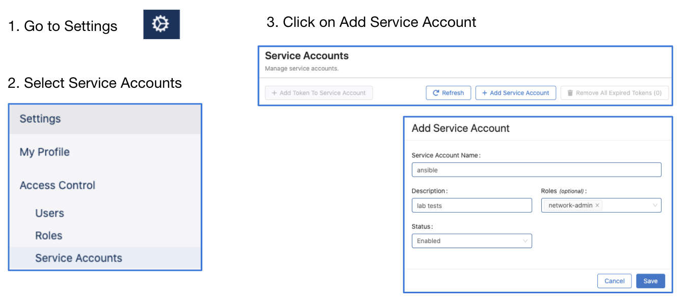
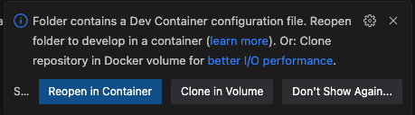
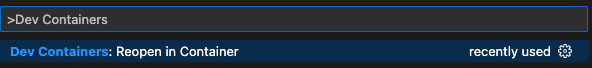

# CloudVision Topology Extractor

The purpose of this project is to convert CloudVision topology information into a valid Arista Cloud Test topology file (yaml).

## Requirements
If using VSCode and Devcontainer
- [VS Code](https://code.visualstudio.com/)
- [Docker](https://www.docker.com/)
- [Remote Development extension pack for VS Code](https://marketplace.visualstudio.com/items?itemName=ms-vscode-remote.vscode-remote-extensionpack)

If using Python Virtual Environment
- Python 3.7+

To access the CloudVision as-a-Service and send API requests, “Service Account Token” is needed. After obtaining the service account token, it can be used for authentication when sending API requests.

Service accounts can be created from the Settings page where a service token can be generated as seen below:




Create a file called `token.tok` and place it in the `auth/` directory, then paste the contents of the service account token into the file.
## VSCode/Devcontainer Usage
> :interrobang: Is Docker Running?
> Ensure Docker is running prior to openning devcontainer, otherwise devcontainer build will fail

1. **Clone the Repository**:
```
   git clone https://github.com/natedoot/cv-to-act-topo.git
   cd cv-to-act-topo
```
2. Open the Project in VS Code:
Open the project folder in VS Code.

3. Reopen in Container:
VSCode should identify the devcontainer files and prompt you to "Reopen in Container"
- Click "Reopen in Container" button in the lower right corner of the VS Code window.



If VSCode does not prompt you after intially openning the project directory, follow these steps:
- Open the Command Pallet (press F1) and type `Dev Containers` -> Select `Dev Containers: Reopen in Container`



4. Execute the Script Inside the Container:
Run the script with your CloudVision server details and any other required arguments. Here's an example:
```
python scripts/main_script.py --apiserver apiserver.arista.io:443 --auth=token,auth/token.tok --pattern <regex of devices to match>
```
Adjust the arguments according to your setup.

Example:
```
python scripts/main_script.py --apiserver apiserver.arista.io:443 --auth=token,auth/token.tok --pattern dc1-
```
## Python virtual environment Usage

1. **Clone the Repository**:
```
   git clone https://github.com/natedoot/cv-to-act-topo.git
   cd cv-to-act-topo
```
2. Create a Virtual Environment
Create a virtual environment using Python's venv module. This will isolate the project's dependencies from the global Python environment.
```
python3 -m venv myenv
```
Replace myenv with the desired name for the virtual environment.

3. Activate the Virtual Environment
Activate the virtual environment. The command varies depending on your operating system:

On macOS and Linux:
```
source myenv/bin/activate
```
On Windows:
```
.\myenv\Scripts\activate
```
4. Install the Required Packages
Next, you need to install the required packages. You can do this using the following commands:
```
pip install cloudvision grpcio pyyaml
```
5. Run the Script
Now, run the `main_script.py` with the required arguments:
```
python scripts/main_script.py --apiserver apiserver.arista.io:443 --auth=token,auth/token.tok --pattern <regex of devices to match>
```
Adjust the arguments according to your setup.

Example:
```
python scripts/main_script.py --apiserver apiserver.arista.io:443 --auth=token,auth/token.tok --pattern dc1-
```
